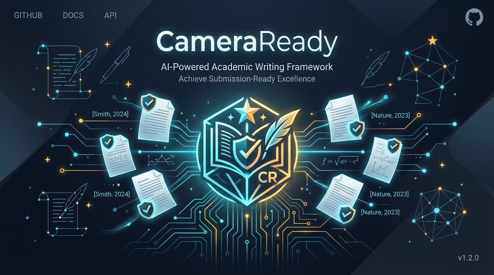
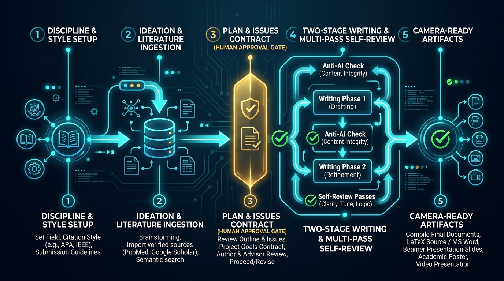

<p align="center">
  <strong>English</strong> · <a href="README.zh-TW.md">繁體中文</a> · <a href="README.zh-CN.md">简体中文</a>
</p>

<p align="center">
  
</p>

<h1 align="center">CameraReady</h1>

<p align="center">
  <strong>From a Topic to Camera-Ready — Gated All the Way.</strong><br>
  <em>An autonomous academic paper pipeline for AI agents, built for uncompromising scientific rigor across disciplines and formats.</em>
</p>

<p align="center">
  <a href="https://opensource.org/licenses/MIT"></a>
  
  
  
  
  
  
</p>

<p align="center">
  <a href="#five-minutes"><strong>⚡ Start in 5 Minutes</strong></a> ·
  <a href="examples/minimal-review-paper/main.pdf"><strong>📄 Sample Output (PDF)</strong></a> ·
  <a href="docs/DEMO.md"><strong>🎥 Interactive Demo</strong></a> ·
  <a href="docs/QUICKSTART.md"><strong>🚀 Quickstart</strong></a> ·
  <a href="docs/GUARANTEES.md"><strong>🛡️ Rigor & Guarantees</strong></a> ·
  <a href="SKILL.md"><strong>⚙️ Workflow Specification</strong></a>
</p>

> [!IMPORTANT]
> **Core Guarantee:** Every citation is fetched live from authoritative sources (DBLP, CrossRef, arXiv API). Every claim must resolve to traceable evidence. Not a single line of prose is drafted until the research plan is human-approved.

---

## The Problem: Why Naive AI Paper Writing Fails

Ask any frontier LLM to draft a paper, and it will produce pages of fluent, convincing prose in seconds. Along the way, it will also:
- **Fabricate citations**: Invent plausible BibTeX entries with realistic titles and hallucinated DOIs.
- **Inflate claims**: Generalize findings far beyond what the cited empirical evidence supports.
- **Violate conference constraints**: Exceed page limits, corrupt formatting, or leak author identities in double-blind submissions.
- **Omit field standards**: Forget clinical trial preregistration (CONSORT), drop qualitative saturation methodology (COREQ), or skip mandatory ethics checklists.

These are not writing flaws; they are **process failures**. In academia, process failures lead to immediate desk rejections.

```
Conventional AI Generation:
  [Prompt] ───────────────► [Hallucinated Draft] ──► Desk Rejection

CameraReady Gated Pipeline:
  [Discipline & Venue Setup] ──► [Live Citation Fetch] ──► [Human-Approved Plan]
                                                                    │
  [Camera-Ready Output] ◄── [Multi-Layer Review] ◄── [Executable Issues Contract]
```

**CameraReady** transforms academic writing into a deterministic, auditable pipeline. Every phase has strict entry conditions, machine-enforced exit gates, and diagnostic tools that report issues rather than silently hallucinating fixes.

---

<a name="five-minutes"></a>

## Five Minutes: From Zero to Scaffold

CameraReady requires **only Python 3.10+** (standard library only for the core pipeline, no `pip install` required).

```bash
# 1. Clone the repository
git clone https://github.com/e96031413/camera-ready.git
cd camera-ready

# 2. View available disciplines and quick-scaffold a project
python scripts/quick_start.py --list
python scripts/quick_start.py --title "Sleep duration and next-day recall" --discipline psychology
```

This instantly scaffolds a complete, verifiable paper workspace:

```text
papers/sleep-duration-and-next-day-recall/
├── main.md                       # Section skeleton with APA front matter (zero invented prose)
├── ref.bib                       # Clean bibliography with verified fetch commands
├── plan/...-sleep-duration....md # Structured research plan awaiting human approval
├── issues/...-sleep-duration....csv # Auditable writing tasks with explicit acceptance criteria
└── notes/autopilot-state.json    # Deterministic state machine, parked at Phase 1/10
```

Now, inspect requirements and compile the document:

```bash
# Check what psychology reviewers and reporting guidelines demand
python scripts/discipline_profile.py requirements psychology

# Export document to Word (.docx) with official APA 7th CSL formatting
python scripts/export_document.py --input papers/sleep-duration-and-next-day-recall/main.md --style apa7

# Check status and see exact exit requirements for Phase 1
python scripts/autopilot.py status --project-dir papers/sleep-duration-and-next-day-recall
```

The initial skeleton builds cleanly without a single invented claim. The argument remains entirely yours.

- **See a real compiled paper**: [`examples/minimal-review-paper/`](examples/minimal-review-paper/README.md) (with committed [`main.pdf`](examples/minimal-review-paper/main.pdf)).
- **Step-by-step terminal transcript**: [`docs/DEMO.md`](docs/DEMO.md) (reproducible with `bash docs/demo-script.sh`).

---

## The Gated Pipeline

<p align="center">
  
</p>

CameraReady orchestrates the research lifecycle across 10 disciplined phases driven by `scripts/autopilot.py`. Each phase verifies exit conditions against real files before unlocking the next stage:

| # | Phase | Stage Name | Exit Condition & Hard Gate |
|:---:|:---|:---|:---|
| **1** | `ideate` | Research Ideation | Research question (RQ) defined via SMART & FINER criteria; boundaries and gap analysis documented. |
| **2** | `literature` | Literature Ingestion | Bibliography populated via DBLP / CrossRef / arXiv; **zero `PLACEHOLDER_` entries allowed**. |
| **3** | `plan` | Plan & Methodology | **Human Sign-Off Gate**: A designated researcher must explicitly approve the plan by name. |
| **4** | `issues` | Execution Contract | 12-column Issues CSV created with DAG dependencies, owners, and criteria; zero dependency cycles. |
| **5** | `experiments` | Experiment & Evidence | Evidence packs assembled and experiment logs recorded (auto-skipped for doctrinal/interpretive fields). |
| **6** | `draft` | Two-Stage Drafting | Outline stage followed by flowing prose; every section issue marked `DONE` against acceptance criteria. |
| **7** | `verify` | Automated Quality Gates | Strict format checks, double-blind anonymity check, privacy scan, and venue checklists all pass. |
| **8** | `review` | Multi-Pass Critique | Automated self-reviews (`logic`, `argument`, `voice`) + cross-model adversarial review produce action items. |
| **9** | `revise` | Systematic Rebuttal | Every review finding resolved with non-TODO explanations and updated citations. |
| **10** | `camera-ready` | Publication Package | Verified arXiv bundle built (`submission.tar.gz`) + Post-acceptance materials generated. **Human submits.** |

> [!NOTE]
> The agent performs the literature discovery, structured writing, and revisions. The state machine enforces discipline. You can force past any gate with `--force --reason "<justification>"`, and the reason is permanently logged into `notes/autopilot-state.json`.

---

## Core Pillars: What Sets CameraReady Apart

### 1. Zero-Hallucination Citation Architecture
In CameraReady, generating references from model memory is strictly forbidden.
- Citations are queried directly from **DBLP, CrossRef, and the official arXiv API**.
- Any citation that cannot be verified against official registries is assigned a `PLACEHOLDER_` prefix.
- `verify_citations.py` halts the pipeline if any placeholder attempts to enter the bibliography.
- `citation_style.py validate` checks every entry against required style fields (e.g., DOIs for APA, numbered IDs for Vancouver, classic BibTeX keys for IEEE).

### 2. Executable Issues CSV as a Contract
Rather than an unstructured to-do list, CameraReady manages paper construction through an auditable 12-column CSV:
- **Columns**: `Issue_ID`, `Section`, `Task_Description`, `Acceptance_Criteria`, `Dependencies`, `Owner`, `Status`, `Verified_Citations`, `Word_Count_Target`, `Notes`.
- `validate_paper_issues.py` validates the schema and performs cycle detection on the dependency DAG.
- Writing is only marked `DONE` when explicit acceptance criteria are satisfied and citation counts are verified.

### 3. Two-Stage Writing & Three-Pass Self-Review
Every section is drafted in two distinct phases:
1. **Stage 1 (Bullet Outline)**: Logical hierarchy, core propositions, and citation anchors are planned.
2. **Stage 2 (Prose Composition)**: Structured conversion to natural academic prose.

Once drafted, the manuscript passes through four specialized diagnostic filters:
- **`logic_selfloop.py`**: Validates logical progression and identifies ungrounded leaps.
- **`argument_selfloop.py`**: Checks that every factual claim has sufficient supporting evidence.
- **`voice_selfloop.py`**: Enforces academic rigor, rhythm, and discipline-appropriate register.
- **`anti_ai_scan.py`**: Flags machine-generated lexical patterns and repetitive stylistic tells.

### 4. Complete Post-Acceptance Lifecycle
Most AI tools stop at "here is a rough draft." CameraReady supports the full publication journey:
- **Conference Papers**: Dual-column IEEEtran, NeurIPS, ICML, ICLR, ACL, AAAI, CVPR templates.
- **Beamer Slides**: XeLaTeX presentations with professional syntax highlighting and TikZ diagrams.
- **PowerPoint**: Native `.pptx` generation with PptxGenJS and vector equation rendering.
- **Academic Posters**: Large-format HTML/CSS responsive posters rendered with Playwright.
- **Video Presentations**: Automated presentation video generation with Remotion and neural TTS.

---

## Multi-Disciplinary & Multi-Style Scope

CameraReady provides tailored profiles for 8 major academic fields, automatically configuring the citation format, document output path, and required reporting standards:

| Discipline | Citation Style | Target Output | Mandatory Reporting Guidelines |
|:---|:---|:---|:---|
| **Computer Science & ML** | IEEE | LaTeX PDF | Venue Checklist (NeurIPS/ICML/ICLR/ACL/AAAI/CVPR) |
| **Psychology & Cognitive Science** | APA 7th | Word / PDF | JARS-Quant, CONSORT, PRISMA |
| **Medicine & Health Sciences** | Vancouver | Word / PDF | CONSORT, STROBE, PRISMA, CARE |
| **Education Research** | APA 7th | Word / PDF | JARS-Qual, COREQ, CHERRIES, PRISMA |
| **Business & Economics** | APA 7th | Word / PDF | PRISMA, CHERRIES |
| **Social Sciences** | Chicago (Author-Date) | Word / PDF | COREQ, SRQR, CHERRIES, STROBE, PRISMA |
| **Humanities & Literature** | MLA 9th | Word / PDF | Textual & Primary Source Attribution |
| **Law & Legal Studies** | Chicago (Notes & Bib) | Word / PDF | Primary Legal Authority Tracking |

> **Extending Profiles**: Adding a new discipline, citation format, or reporting guideline requires only a YAML or Markdown definition. See [`docs/EXTENDING.md`](docs/EXTENDING.md).

---

## Automated Verification Gates

The pipeline includes specialized validation scripts that act as uncompromising gatekeepers:

| Gate Script | What It Catches | Behavior |
|:---|:---|:---|
| `format_gate.py` | Page limit overruns, missing mandatory sections, unauthorized style modification. | **Blocks build** |
| `anonymity_check.py` | Author names, `\thanks`, institutional emails, named git repos in double-blind mode. | **Blocks build** |
| `verify_citations.py` | Unresolved citation keys, hallucinated BibTeX, remaining `PLACEHOLDER_` entries. | **Blocks build** |
| `citation_style.py` | Missing mandatory metadata fields required by the active citation style. | **Blocks build** |
| `integrity_gate.py` | Overstated conclusions, claims exceeding cited evidence scope. | **Flags findings** |
| `anti_ai_scan.py` | Overused AI buzzwords, repetitive sentence rhythms, unnatural phrasing. | **Target: LOW** |
| `paper_privacy_scan.py` | Leaked API tokens, internal server hostnames, local user directories. | **Blocks build** |
| `paper_checklist.py` | Blank or invalid venue checklist items (e.g. NeurIPS paper checklist). | **Blocks build** |
| `reporting_guideline.py` | Unanswered items in PRISMA, CONSORT, STROBE, COREQ, SRQR, CARE, JARS. | **Blocks build** |
| `arxiv_package.py` | Missing graphics, un-inlined `.bbl`, absolute paths, oversized assets. | **Clean tarball** |
| `portability_check.py` | OS-specific encoding traps, hardcoded POSIX paths, non-portable python invocations. | **CI Enforced** |
| `skill_spec_check.py` | Non-conforming frontmatter or spec violations for the Agent Skills standard. | **CI Enforced** |

> [!TIP]
> **Reporting Philosophy:** Gates never alter your paper silently and never auto-fill answers. `paper_checklist.py` inserts `[TODO]` placeholders and requires human verification for compliance. See [`docs/GUARANTEES.md`](docs/GUARANTEES.md).

---

## Conference Support

Official configurations with validated page limits, layout requirements, and style retrieval:

| Venue | Main Page Limit | Layout Standard | Checklist Requirement | Configuration |
|:---|:---|:---|:---|:---|
| **NeurIPS** | 9 pages | Single-column, 10pt | Mandatory | [`neurips.yaml`](assets/venues/neurips.yaml) |
| **ICML** | 8 pages | Two-column, 10pt | Mandatory | [`icml.yaml`](assets/venues/icml.yaml) |
| **ICLR** | 9 pages | Single-column, 10pt | Required | [`iclr.yaml`](assets/venues/iclr.yaml) |
| **ACL** | 8 pages (long) | Two-column, 11pt, A4 | Required | [`acl.yaml`](assets/venues/acl.yaml) |
| **AAAI** | 7 + 1 + 1 pages | Two-column, 10pt | Required | [`aaai.yaml`](assets/venues/aaai.yaml) |
| **CVPR** | 8 pages | Two-column, 10pt | Not required | [`cvpr.yaml`](assets/venues/cvpr.yaml) |
| **arXiv** | Unlimited | IEEEtran two-column | Optional | Bundled template |

*Venue style files are downloaded dynamically at runtime via `scripts/venue_setup.py` directly from official conference portals to respect distribution licenses.*

---

## Environment & Prerequisites

### Minimal Setup
- **Python 3.10+**: Zero external pip packages needed for the core scaffolding and gate checking.

### Optional Toolchains by Deliverable
| Desired Deliverable | Required Toolchain |
|:---|:---|
| **LaTeX PDF (IEEE / Conference)** | TeX Live, MacTeX, or MiKTeX |
| **LaTeX PDF (APA / MLA / Chicago / Vancouver)** | TeX Live / MiKTeX with `biber` and style packages |
| **Word / Markdown / Typst / HTML** | `pandoc` (`python scripts/export_document.py --check`) |
| **Beamer Presentation Slides** | XeLaTeX |
| **PowerPoint (.pptx)** | Node.js + PptxGenJS (`pandoc` for math rendering) |
| **Academic HTML Poster** | Playwright + Chromium, Pillow |
| **Narrated Video Presentation** | Node.js + Remotion, neural TTS engine, `ffprobe` |

---

## Using as an Agent Skill

CameraReady fully implements the [Agent Skills](https://agentskills.io) open standard.

```bash
# Install into Claude Code
cp -r . ~/.claude/skills/camera-ready

# Then invoke inside Claude Code:
/camera-ready
```

- Works seamlessly with **Claude Code**, **claude.ai**, **Gemini CLI**, **Codex**, and autonomous agent loops.
- **Also works 100% standalone**: Every script in `scripts/` can be executed directly by humans in terminal.

---

## FAQ

<details>
<summary><strong>Does CameraReady write the paper entirely on its own?</strong></summary>

CameraReady provides scaffolding, verification gates, citation validation, and iterative drafting. While `autopilot.py` can orchestrate an end-to-end run, the scientific hypotheses, substantive arguments, and checklist responses belong to the human researcher. Key phases (such as Research Plan approval) strictly require human authorization to advance.
</details>

<details>
<summary><strong>How does CameraReady guarantee citations are not fabricated?</strong></summary>

All bibliographic entries must be resolved via official APIs (DBLP, CrossRef, arXiv Registry). If an API lookup fails, the tool creates a `PLACEHOLDER_` marker rather than inventing a citation. The verification gate (`verify_citations.py`) treats any remaining placeholder as a fatal build error.
</details>

<details>
<summary><strong>Can I use CameraReady if my journal requires Microsoft Word?</strong></summary>

Yes! CameraReady treats Word (`.docx`) as a first-class output format for fields such as psychology, medicine, and social sciences. You draft in clean Markdown with semantic citation keys, and `export_document.py` compiles to Word using official CSL (Citation Style Language) formatting.
</details>

<details>
<summary><strong>Does CameraReady automatically upload to arXiv or conference portals?</strong></summary>

**Never.** `arxiv_package.py` creates a sanitized, verified tarball (`submission.tar.gz`) locally. In accordance with our Follow-Through Policy and [`SECURITY.md`](SECURITY.md), submitting to any public server or conference portal is strictly a manual step performed by the researcher.
</details>

---

## Repository Layout

```text
camera-ready/
├── SKILL.md                  # Complete gated workflow specification for AI agents
├── assets/
│   ├── disciplines/          # Discipline profiles (8 fields)
│   ├── styles/               # Citation style definitions (6 formats)
│   ├── venues/               # Conference configurations (NeurIPS, ICML, ICLR, etc.)
│   ├── checklists/           # Venue checklists & reporting guidelines (PRISMA, CONSORT...)
│   ├── images/               # Repository visual assets & workflow diagrams
│   └── template/             # LaTeX, Beamer, Poster, and Video templates
├── docs/
│   ├── QUICKSTART.md         # Step-by-step practical onboarding guide
│   ├── DEMO.md               # Verifiable execution transcript
│   ├── GUARANTEES.md         # Exact breakdown: verified vs. detected vs. human
│   ├── EXTENDING.md          # Guide for adding venues, disciplines, and guidelines
│   └── TROUBLESHOOTING.md    # Common errors, diagnosis, and resolutions
├── examples/
│   └── minimal-review-paper/ # Fully compiled reference paper with plan & reports
├── references/               # Deep-dive guides on citations, style, and rebuttal
├── scripts/                  # Standalone CLI tools for scaffolding, gates, and compilation
└── tests/                    # Cross-platform test suite (420+ tests on Win/macOS/Linux)
```

---

## License

Distributed under the [MIT License](LICENSE). Third-party templates (`IEEEtran.cls`, conference style files, and CSL profiles) retain their original licenses as detailed in [THIRD_PARTY_NOTICES.md](THIRD_PARTY_NOTICES.md).
